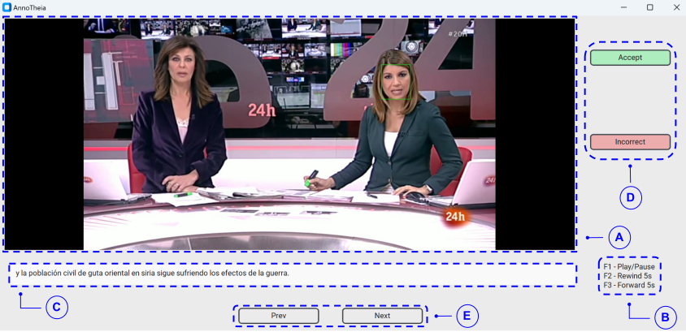
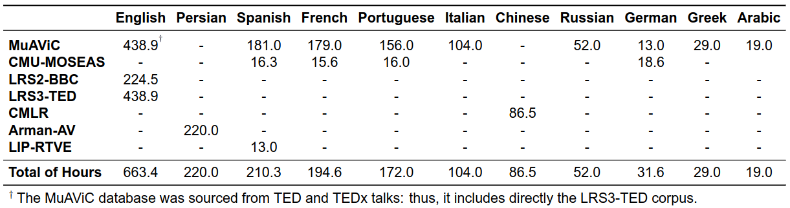

<h1 align="center"><span style="font-weight:normal">AnnoTheia 🗺️</h1>
<h2 align="center">A Semi-Automatic Annotation ✍️ Toolkit for</br>Audio-Visual 🎥🎙️ Speech Technologies</h2>    
<div align="center">

[José-Miguel Acosta-Triana](), [David Gimeno-Gómez](https://scholar.google.es/citations?user=DVRSla8AAAAJ&hl=en), [Carlos-D. Martínez-Hinarejos](https://scholar.google.es/citations?user=M_EmUoIAAAAJ&hl=en)
</div>

<div align="center">
  
[📘 Introduction](#intro) |
[🛠️ Preparation](#preparation) |
[🚀 Get on with it!](#getonwithit) |
[💕 How can I help?](#helping) |
[🦒 Database Zoo](#databasezoo) |
[📖 Citation](#citation) |
[📝 License](#license)
</div>

<div align="center">  </div>

## <a name="intro"></a> 📘 Introduction

- **Motivation.** More than 7,000 known languages are spoken around the world. However, only a small fraction of them are currently covered by speech technologies. In addition, if that weren't enough, many of these languages are considered endangered and the lack of support from current technologies may contribute negatively to this situation. For this reason, to avoid any type of discrimination or exclusion, we encourage people to contribute to this research project whose purpose is to cover the greatest possible number of languages in the context of audio-visual speech technologies. 🌟 **Wouldn't you like to make the table shown below larger?** Find more information about in our [💕 How can I help?](#helping) section.

<div align="center">  </div>

- **The AnnoTheia Toolkit.** We present AnnoTheia, a semi-automatic toolkit that detects when a person speaks on the scene and the corresponding transcription. One of the most notable aspects of the proposed toolkit is the flexibility to replace a module with another of our preference or, where appropriate, adapted to our language of interest. Therefore, to show the complete process of preparing AnnoTheia for a language of interest, we also describe [in this tutorial 📜](modules/active_speaker_detection/talknet_asd/) the adaptation of a pre-trained TalkNet-ASD model to a specific language, using a database not initially conceived for this type of task.

- **The User Interface.** Looking at the image shown above. **A**: Video display of the scene candidate to be a new sample of the future database. An overlying  green bounding box highlights the speaker detected by the toolkit. **B**: Keyword legend to control the video display. **C**: Transcription automatically generated by the toolkit. It can be edited by the annotator. **D**: Buttons to allow the annotator to accept or discard the candidate scene sample. **E**: Navigation buttons through candidate scenes. It can be useful to correct possible annotation mistakes.</p>

## <a name="preparation"></a> 🛠️ Preparation

- Create and activate a new conda environment:

```
conda create -y -n annotheia python=3.10
conda activate annotheia
```
- Install all requirements to prepare the environment:

```
python ./prepare_environment.py
```

## <a name="getonwithit"></a> 🚀 Get on with it!

The AnnoTheia toolkit is divided into two stages:

- **Detect Candidate Scenes** to compile the new audio-visual database from long videos:

```
python main_scenes.py \
    --video_dir ${PATH_TO_VIDEO_DIR} \
    --config-file ${PATH_TO_CONFIG_FILE} \
    --output-dir ${PATH_TO_OUTPUT_DIR}
```

- **Supervise & Annotate** the candidate scenes detected by the toolkit. Once the script above warns you that a video has been fully processed, you can run the following command:

```
python main_gui.py --scenes-info-path ${PATH_TO_SCENES_INFO_CSV}
```
🌟 We plan to unify both stages. Any comments or suggestions in this regard will be of great help!

## <a name="helping"></a> 💕 How can I help?

<a href="https://www.nature.com/articles/s41559-021-01604-y">Many of the world’s languages are in danger of disappearing.</a> Our hope is to encourage the community to promote research in the field of audiovisual speech technologies for low-resource languages. It will be a long road but here we explain three ways to help our project:

- **Fine-Tuning TalkNet-ASD for another Language.** Take a look at our [tutorial](https://github.com/joactr/AnnoTheia/tree/david-branch/modules/active_speaker_detection/talknet_asd) tutorial 📜!
- **Collecting New Audio-Visual Databases.** Once it is compiled, it will be welcome to our [🦒 Database Zoo](#databasezoo)!
- **Adding new alternative models to the pipeline's modules.** We prepared [another tutorial]() for you. And it might even be possible to add new modules, such as a body landmarker!
- **Sharing the AnnoTheia's toolkit with your Colleagues.** The more, the merrier 💫!
- **Any other comment or suggestion?** You are more than welcome to create an issue :)

### How many languages are we currently covering?

<div align="center">
  
✅ English 🇬🇧 &nbsp;&nbsp;&nbsp;&nbsp;&nbsp;&nbsp;&nbsp;&nbsp;
✅ Spanish 🇪🇸 &nbsp;&nbsp;&nbsp;&nbsp;&nbsp;&nbsp;&nbsp;&nbsp;
⬜ Czech 🇨🇿 &nbsp;&nbsp;&nbsp;&nbsp;&nbsp;&nbsp;&nbsp;&nbsp;
⬜ Kalanga 🇿🇼 &nbsp;&nbsp;&nbsp;&nbsp;&nbsp;&nbsp;&nbsp;&nbsp;
⬜ Polish 🇵🇱 &nbsp;&nbsp;&nbsp;&nbsp;&nbsp;&nbsp;&nbsp;&nbsp;

⬜ Turkish 🇹🇷 &nbsp;&nbsp;&nbsp;&nbsp;&nbsp;&nbsp;&nbsp;&nbsp;
⬜ Japanase 🇯🇵 &nbsp;&nbsp;&nbsp;&nbsp;&nbsp;&nbsp;&nbsp;&nbsp;
⬜ Fijian 🇫🇯 &nbsp;&nbsp;&nbsp;&nbsp;&nbsp;&nbsp;&nbsp;&nbsp;
⬜ Malay 🇲🇾 &nbsp;&nbsp;&nbsp;&nbsp;&nbsp;&nbsp;&nbsp;&nbsp;
⬜ Somali 🇸🇴 &nbsp;&nbsp;&nbsp;&nbsp;&nbsp;&nbsp;&nbsp;&nbsp;

⬜ Romanian 🇷🇴 &nbsp;&nbsp;&nbsp;&nbsp;&nbsp;&nbsp;&nbsp;&nbsp;
⬜ Vietnamese 🇻🇳 &nbsp;&nbsp;&nbsp;&nbsp;&nbsp;&nbsp;&nbsp;&nbsp;
⬜ Berber 🇲🇦 &nbsp;&nbsp;&nbsp;&nbsp;&nbsp;&nbsp;&nbsp;&nbsp;
⬜ Quechua 🇵🇪 &nbsp;&nbsp;&nbsp;&nbsp;&nbsp;&nbsp;&nbsp;&nbsp;
⬜ Māori 🇳🇿 &nbsp;&nbsp;&nbsp;&nbsp;&nbsp;&nbsp;&nbsp;&nbsp;

⬜ Norwegian 🇳🇴 &nbsp;&nbsp;&nbsp;&nbsp;&nbsp;&nbsp;&nbsp;&nbsp;
⬜ Hindi 🇮🇳 &nbsp;&nbsp;&nbsp;&nbsp;&nbsp;&nbsp;&nbsp;&nbsp;
⬜ Swahili 🇹🇿 &nbsp;&nbsp;&nbsp;&nbsp;&nbsp;&nbsp;&nbsp;&nbsp;
⬜ Urdu 🇵🇰 &nbsp;&nbsp;&nbsp;&nbsp;&nbsp;&nbsp;&nbsp;&nbsp;
⬜ and so on ... 🏳️ &nbsp;&nbsp;&nbsp;&nbsp;&nbsp;&nbsp;&nbsp;&nbsp;

</div>

🌟 Help us cover languages around the world 🗺️! It will be a great contribution to the research community to move towards a fairer development of speech technologies.

## <a name="databasezoo"></a> 🦒 Database Zoo

- 🇪🇸 **LIP-RTVE**: [An Audio-Visual Database for Continuous Spanish in the Wild](https://aclanthology.org/2022.lrec-1.294/)
- *Place for your future database :)*

## <a name="citation"></a> 📖 Citation
If you found our work useful, please cite our paper:

[AnnoTheia: A Semi-Automatic Annotation Toolkit for Audio-Visual Speech Technologies]()

```
@inproceedings{acosta24annotheia,
  author="Acosta-Triana, José-Miguel and Gimeno-Gómez, David and Martínez-Hinarejos, Carlos-D",
  title="AnnoTheia: A Semi-Automatic Annotation Toolkit for Audio-Visual Speech Technologies",
  booktitle="",
  volume="",
  number="",
  pages="",
  year="2024",
}
```

## <a name="license"></a> 📝 License
This work is protected by []()
