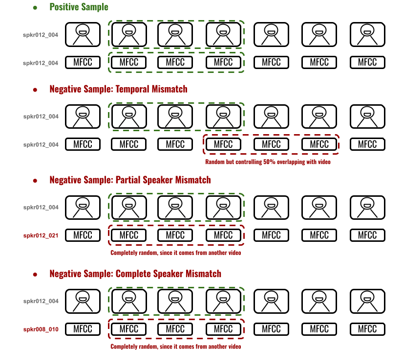

<h1 align="left"> 📜 Fine-Tuning TalkNet-ASD to the Language I am Interested On</h1>

In this tutorial, we are goint to learn how to fine-tune the [TalkNet-ASD model](https://dl.acm.org/doi/abs/10.1145/3474085.3475587) to our language of interest. To do this, here you can find different tips regarding how we can collect data, as well as the code for data preparation, model training and its incorporation into the toolkit.

## 🦺 Conda Environment Setup

Just in case we are not where we should:

```
cd ./modules/active_speaker_detection/talknet_asd/
conda activate annotheia
```

## ⛏️ Data Collection

As you could expect, the first thing we need is data. This is the most complicated of the steps in this tutorial. Find the following tips here:

- **What do we need?** → Videos where only one person appears on scene and is speaking
- **Where can we find these types of videos?** → One way is to search social media for the most popular vloggers who upload videos in the language of your interest. Please ask for permission if you plan to publish this data.
- **How many data do we need?** → Of course, the more, the better. However, **please note that this ASD models work at window level** and usually these windows do not span more than 2 seconds. So the good news is that from a small number of vlogs we will be able to extract hundreds of window samples to estimate our TalkNet-ASD model.
- **Anything else?** → Try to collect as many different speakers as possible to estimate a model robust against people it has never seen. For this reason, you should **keep in mind this speaker independency** when creating the dataset splits.

Once you have collected your data (Congratulations👏!), in order to run the scripts described in the following steps of this tutorial, please **organize your videos like** this structure scheme:

```
videos_swahili/
├── training/
│   ├── speaker000/
│   │   ├── speaker000_0000.mp4
│   │   ├── speaker000_0001.mp4
│   │   ├── ...
│   ├── speaker001/
│   │   ├── ...
│   ├── ...
├── validation/
│   ├── speaker020/
│   │   ├── speaker020_0000.mp4
│   │   ├── ...
│   ├── ...
├── test/
│   ├── speaker025/
│   │   ├── speaker030_0000.mp4
│   │   ├── ...
│   ├── ...
```
✨ **Tip:** If your videos are very long, please split each one into chunks of 20 seconds using the ```ffmpeg``` package.

## 🛠️ Data Preparation

In this section, we are going to prepare all the things we need to fine-tune our pre-trained TalkNet-ASD model:

- **Extracting Face Crops.** Running the following script we will obtain the 112x112 face crops TalkNet-ASD is expecting:

```
python ./scripts/extract_face_crops.py \
    --video-dir ./videos_swahili/ \
    --face-crops-output-dir ./data/swahili/face_crops/
```

- **Extracting MFCCs.** Running the following script we will extract the 13 Mel Frequency Cepstral Coefficients (MFCCs) at 100fps TalkNet-ASD is expecting:

```
python ./scripts/extract_mfccs.py \
    --video-dir ./videos_swahili/ \
    --face-crops-dir ./data/swahili/face_crops/ \
    --mfccs-output-dir ./data/swahili/mfccs/
```
✨ **Detail:** Both the face crops and MFCCs are stored following the directory structure described above.

✨ **Another Detail:** For efficiency reasons, both faces and MFCCs are saved as compressed ```.npz``` files using the ```numpy``` library.

- **Creating Window-Level Dataset Splits.** Using this script we will get the training, validation, and test dataset splits at window level we need to estimate our TalkNet-ASD model. Note that the ```--windows-per-sample``` refers to the number of windows we will consider for each video clip in the database.

```
python ./scripts/create_window_dataset_splits.py \
    --face-crops-dir ./data/swahili/face_crops/ \
    --splits-output-dir ./data/swahili/splits/
```

✨ **Details:** This is how our dataset splits look:

<div align="center">  </div>

where each row corresponds to one window sample and the `video_window_center` column indicates the index in the face crop sequence where the center of the window sample will be. Depending on the `label`, we will have **positive** or **negative** samples. Find below an image explaining the different three type of window samples we designed. Of course, you can find more information [in our paper 📃]().

<div align="center">  </div>

## 🔮 Fine-Tuning TalkNet-ASD

It is time to fine-tune our TalkNet-ASD to our language 💕! Running the following script:

```
python ./main_train.py \
    --training-dataset ./data/swahili/splits/training.csv \
    --validation-dataset ./data/swahili/splits/validation.csv \
    --test-dataset ./data/swahili/splits/test.csv \
    --output-dir ./data/swahili/exps/
```

we  will fine-tune the pre-trained TalkNet-ASD for English, a model that was trained on the [AVA-ActiveSpeaker dataset](https://ieeexplore.ieee.org/document/9053900). If you want to explore more hyper-parameters, you can always run: ```python ./main_train.py --help```.

## 💕 Share it!

- **Do a Pull Request.** Different aspects to take into account:
    - Upload your model checkpoint, e.g., in [Zenodo](https://zenodo.org/).
    - Create a new config file for your language. You only will have to:
        - change [this line](https://github.com/joactr/AnnoTheia/blob/david-branch/configs/annotheia_pipeline_english.yaml#L22) specifying the new model checkpoint.
        - add a coment to the link where the future user can find and download the new model checkpoint.
    - Ask for the Pull Request.
- **Create an Issue** in case of doubts. No worries :)

## 🔭 Next Step

- **Compile a new audio-visual database for your language**
- **Include it in our 🦒 Database Zoo Section**


